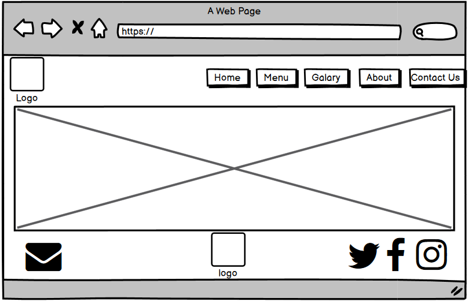
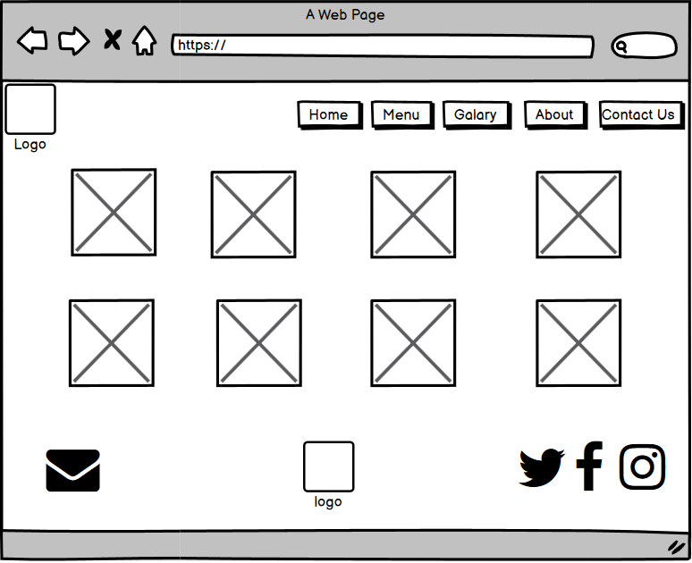

# Yemeni Mandi Restaurant
this is a website for arabic restautant, serving a traditional dishes like Mandi.<h1>
## Table of contents
* [Home](#home)
* [Menu](#menu)
* [Gallery](#gallery)
* [About Us](#menu)
* [Contact Us](#gallery)
<h1>

## Skeleton
* Home page:

* Menu page:

* Gallery page:

* About-Us page:

* Contact-Us page:

*Mobile version for Home page:

  

<h1>

## Technologies
Project is created with:
* HTML 5
* CSS 3
* Bootstrap 4
* GOOGLE FONTS
* FONT AWESOME
* GITHUB
* BALSAMIQ
<h1>

## Testing
* To test my CSS I used the W3C validation service
* To test my HTML I also used the W3C validation service
* I tested my site on a variety of different size devices to check if it was responsive.
<h1>

## Deployment
This project was deployed on github.com, to deploy the project:
* login to github and locate repository.
* at the top of the repo click the settings button.
* locate github pages section.
* under source, click the dropdown called none and select the Master Branch.
* go back down through the page and find the site link in github pages section.
<h1>

## Credits
* google.com for my gallery image used throughout the site.
* Bootstrap4.com for my nav and code throughout the project.
* Googlefonts.com for the font I used in the site.
* Fontawesome.com for the icons in my footer.
<h1>

## Acknowledgements
*This site is for educational purposes only!

<h1>